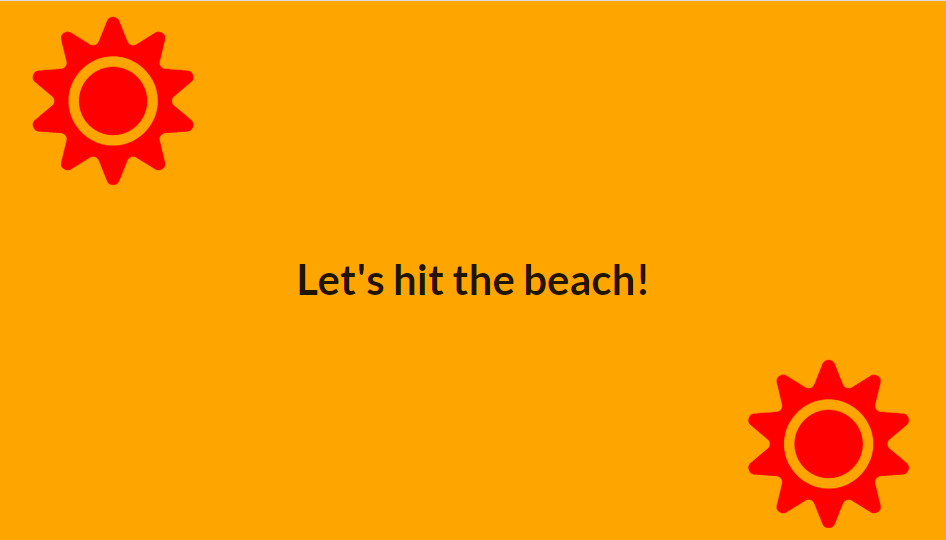
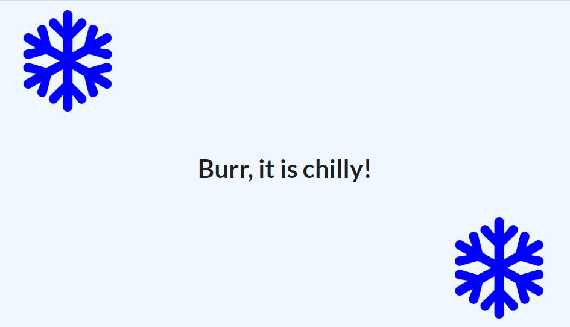

# Season-Display-React-App

This app displays text and icons based on the current season(summer/winter) at the user's location.

This project emphasized points in ReactJS:
* Structuring apps with class-based components
* State in components
* Understanding Lifecycle Methods

Dependencies Used:
* Semantic UI - used for basic styling and icons

Project 2 in the Modern React with Redux course with Stephen Grider
